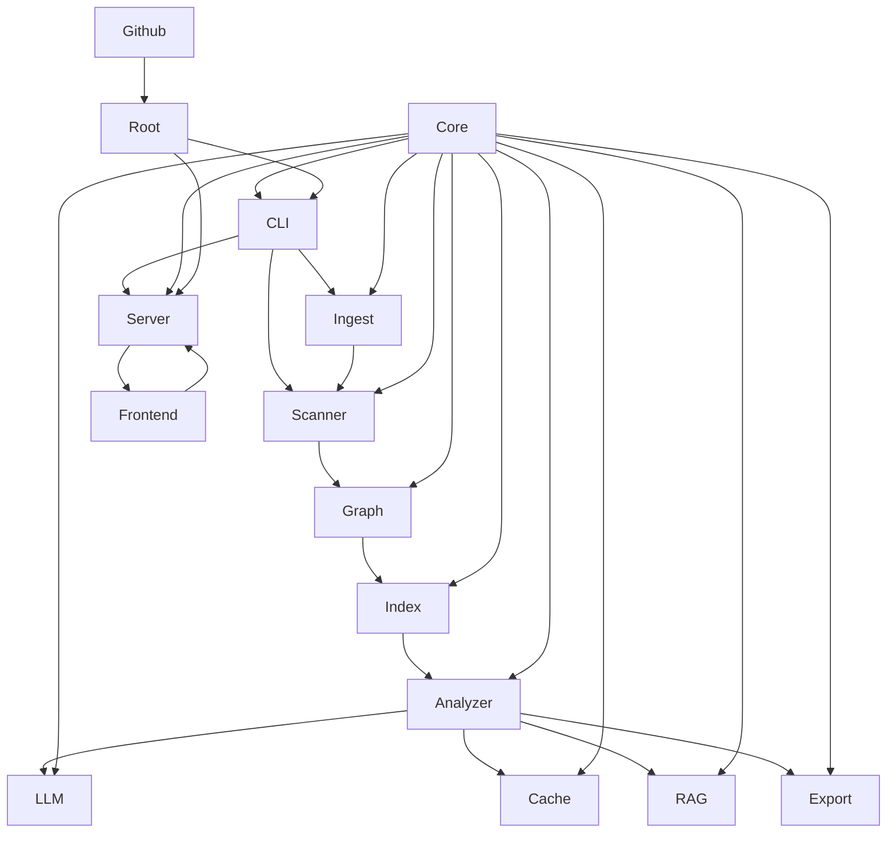
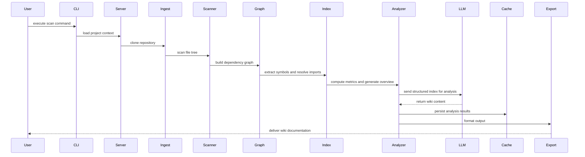

# Architecture

**Type:** client-server

The system follows a client-server architecture built on a modular Rust workspace. A React frontend communicates with an Axum-based API server, which orchestrates a deterministic data processing pipeline for codebase analysis. The same backend powers both a terminal CLI and a web interface, enabling flexible interaction patterns while sharing core libraries.

## Component Diagram

## Components

### frontend

React-based web interface for viewing wikis, chatting, and rendering diagrams.

Files: [`frontend/package.json`](frontend), [`frontend/tsconfig.json`](frontend), [`frontend/vite.config.ts`](frontend), [`frontend/src/App.tsx`](frontend), [`frontend/index.html`](frontend), [`frontend/package-lock.json`](frontend), [`frontend/src/components/MermaidDiagram.tsx`](frontend), [`frontend/src/components/SettingsModal.tsx`](frontend), [`frontend/src/components/WikiContent.tsx`](frontend), [`frontend/src/components/WikiSidebar.tsx`](frontend), [`frontend/src/index.css`](frontend), [`frontend/src/lib/api.ts`](frontend), [`frontend/src/main.tsx`](frontend), [`frontend/src/pages/ChatView.tsx`](frontend), [`frontend/src/pages/Home.tsx`](frontend), [`frontend/src/pages/WikiView.tsx`](frontend), [`frontend/src/stores/wiki.ts`](frontend), [`frontend/src/vite-env.d.ts`](frontend)

### server

Axum HTTP and WebSocket server providing REST APIs and serving the static frontend.

Files: [`crates/server/Cargo.toml`](server), [`crates/server/src/lib.rs`](server), [`crates/server/src/models.rs`](server), [`crates/server/src/routers/chat.rs`](server), [`crates/server/src/routers/mod.rs`](server), [`crates/server/src/routers/scan.rs`](server), [`crates/server/src/routers/wiki.rs`](server)

### export

Formats analyzed wiki data into HTML, JSON, or Markdown outputs.

Files: [`crates/export/Cargo.toml`](export), [`crates/export/src/html.rs`](export), [`crates/export/src/json_export.rs`](export), [`crates/export/src/lib.rs`](export), [`crates/export/src/markdown.rs`](export), [`crates/export/src/site.rs`](export)

### root

Project root containing workspace configuration, documentation, and environment templates.

Files: [`.env.example`](root), [`Cargo.toml`](root), [`README.md`](root), [`.gitignore`](root), [`LICENSE`](root), [`README_CN.md`](root)

### index

Builds symbol indexes, computes complexity metrics, and resolves cross-file imports.

Files: [`crates/index/Cargo.toml`](index), [`crates/index/src/extract.rs`](index), [`crates/index/src/flow.rs`](index), [`crates/index/src/lib.rs`](index), [`crates/index/src/resolve.rs`](index)

### core

Shared configuration management, model resolution, and foundational type definitions.

Files: [`crates/core/Cargo.toml`](core), [`crates/core/src/config.rs`](core), [`crates/core/src/lib.rs`](core), [`crates/core/src/models.rs`](core)

### ingest

Handles repository cloning and URL parsing for GitHub and local filesystem sources.

Files: [`crates/ingest/Cargo.toml`](ingest), [`crates/ingest/src/github.rs`](ingest), [`crates/ingest/src/lib.rs`](ingest), [`crates/ingest/src/local.rs`](ingest)

### llm

Manages communication with external LLM providers, handling prompts, messages, and responses.

Files: [`crates/llm/Cargo.toml`](llm), [`crates/llm/src/client.rs`](llm), [`crates/llm/src/lib.rs`](llm), [`crates/llm/src/prompts.rs`](llm)

### scanner

Traverses directory trees, applies ignore patterns, and identifies target source files.

Files: [`crates/scanner/Cargo.toml`](scanner), [`crates/scanner/src/ignore_rules.rs`](scanner), [`crates/scanner/src/lib.rs`](scanner), [`crates/scanner/src/scan.rs`](scanner)

### github

CI/CD workflows for continuous integration testing and package publishing.

Files: [`.github/workflows/ci.yml`](.github), [`.github/workflows/publish.yml`](.github)

### analyzer

Orchestrates the analysis pipeline, tracks progress, generates overviews, and coordinates LLM requests.

Files: [`crates/analyzer/Cargo.toml`](analyzer), [`crates/analyzer/src/lib.rs`](analyzer)

### cache

Provides persistent SQLite-based caching for LLM results and computed metrics.

Files: [`crates/cache/Cargo.toml`](cache), [`crates/cache/src/lib.rs`](cache)

### cli

Command-line interface entry point that parses arguments and dispatches scan, serve, and chat commands.

Files: [`crates/cli/Cargo.toml`](cli), [`crates/cli/src/main.rs`](cli)

### graph

Constructs dependency graphs using PageRank ranking and maps module relationships.

Files: [`crates/graph/Cargo.toml`](graph), [`crates/graph/src/lib.rs`](graph)

### rag

Implements Retrieval-Augmented Generation indexing and chunking for efficient context retrieval.

Files: [`crates/rag/Cargo.toml`](rag), [`crates/rag/src/lib.rs`](rag)

## Sequence Diagram

## Data Flow

Repository data flows through a deterministic pipeline starting with ingestion and file scanning. The scanner feeds filtered paths to the graph builder, which maps dependencies before the indexer extracts symbols and resolves imports. These compact summaries are passed to the analyzer, which orchestrates LLM calls using cached results and RAG context, finally delivering structured content to the exporter for final formatting.
