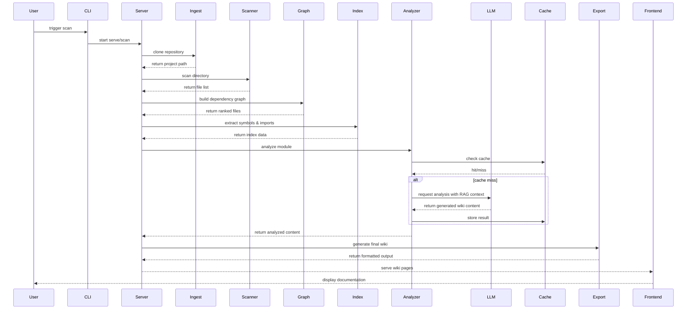

# Architecture

**Type:** client-server

The system implements a client-server architecture where a Rust-based backend exposes both a CLI and an HTTP API, while a React frontend delivers the interactive documentation browser. Core processing follows a deterministic pipeline that ingests repositories, scans files, builds dependency graphs, indexes symbols, and leverages an LLM with RAG to generate structured wiki content. Results are cached and exported as static sites or served dynamically via the backend.

## Component Diagram

```mermaid
graph TD
  root[Root] --> cli[CLI]
  root --> server[Server]
  root --> frontend[Frontend]
  root --> github_actions[GitHub Actions]
  cli --> ingest[Ingest]
  cli --> scanner[Scanner]
  cli --> graph[Graph]
  cli --> cache[Cache]
  cli --> llm[LLM]
  cli --> rag[RAG]
  cli --> index[Index]
  cli --> analyzer[Analyzer]
  cli --> export[Export]
  server --> ingest
  server --> scanner
  server --> graph
  server --> cache
  server --> llm
  server --> rag
  server --> analyzer
  server --> export
  frontend --> server
  analyzer --> llm
  analyzer --> rag
  analyzer --> index
  analyzer --> graph
  analyzer --> cache
  index --> graph
  index --> cache
  ingest --> scanner
  scanner --> core[Core]
  graph --> core
  cache --> core
  llm --> core
  rag --> core
  index --> core
  analyzer --> core
  export --> core
```

## Components

### frontend

React-based SPA providing the interactive wiki browser, chat interface, and settings modal.

Files: [`frontend/package.json`](modules/frontend.md), [`frontend/tsconfig.json`](modules/frontend.md), [`frontend/vite.config.ts`](modules/frontend.md), [`frontend/src/App.tsx`](modules/frontend.md), [`frontend/index.html`](modules/frontend.md), [`frontend/package-lock.json`](modules/frontend.md), [`frontend/src/components/MermaidDiagram.tsx`](modules/frontend.md), [`frontend/src/components/SettingsModal.tsx`](modules/frontend.md), [`frontend/src/components/WikiContent.tsx`](modules/frontend.md), [`frontend/src/components/WikiSidebar.tsx`](modules/frontend.md), [`frontend/src/index.css`](modules/frontend.md), [`frontend/src/lib/api.ts`](modules/frontend.md), [`frontend/src/main.tsx`](modules/frontend.md), [`frontend/src/pages/ChatView.tsx`](modules/frontend.md), [`frontend/src/pages/Home.tsx`](modules/frontend.md), [`frontend/src/pages/WikiView.tsx`](modules/frontend.md), [`frontend/src/stores/wiki.ts`](modules/frontend.md), [`frontend/src/vite-env.d.ts`](modules/frontend.md)

### server

Axum-based HTTP service exposing REST/WebSocket endpoints for scanning, chatting, and wiki retrieval.

Files: [`crates/server/Cargo.toml`](modules/server.md), [`crates/server/src/lib.rs`](modules/server.md), [`crates/server/src/models.rs`](modules/server.md), [`crates/server/src/routers/chat.rs`](modules/server.md), [`crates/server/src/routers/mod.rs`](modules/server.md), [`crates/server/src/routers/scan.rs`](modules/server.md), [`crates/server/src/routers/wiki.rs`](modules/server.md)

### export

Generates static wiki output in Markdown, HTML, and JSON formats with cross-linking support.

Files: [`crates/export/Cargo.toml`](modules/export.md), [`crates/export/src/html.rs`](modules/export.md), [`crates/export/src/json_export.rs`](modules/export.md), [`crates/export/src/lib.rs`](modules/export.md), [`crates/export/src/markdown.rs`](modules/export.md), [`crates/export/src/site.rs`](modules/export.md)

### root

Project root containing configuration, metadata, licensing, and environment templates.

Files: [`.env.example`](modules/root.md), [`Cargo.toml`](modules/root.md), [`README.md`](modules/root.md), [`.gitignore`](modules/root.md), [`LICENSE`](modules/root.md), [`README_CN.md`](modules/root.md)

### index

Extracts code symbols, computes complexity metrics, and resolves language-specific imports.

Files: [`crates/index/Cargo.toml`](modules/index.md), [`crates/index/src/extract.rs`](modules/index.md), [`crates/index/src/flow.rs`](modules/index.md), [`crates/index/src/lib.rs`](modules/index.md), [`crates/index/src/resolve.rs`](modules/index.md)

### core

Shared foundation providing configuration parsing, common data models, and utility functions.

Files: [`crates/core/Cargo.toml`](modules/core.md), [`crates/core/src/config.rs`](modules/core.md), [`crates/core/src/lib.rs`](modules/core.md), [`crates/core/src/models.rs`](modules/core.md)

### ingest

Handles repository acquisition by cloning local directories or remote Git URLs securely.

Files: [`crates/ingest/Cargo.toml`](modules/ingest.md), [`crates/ingest/src/github.rs`](modules/ingest.md), [`crates/ingest/src/lib.rs`](modules/ingest.md), [`crates/ingest/src/local.rs`](modules/ingest.md)

### llm

Abstraction layer for interacting with external LLM providers, managing prompts and chat messages.

Files: [`crates/llm/Cargo.toml`](modules/llm.md), [`crates/llm/src/client.rs`](modules/llm.md), [`crates/llm/src/lib.rs`](modules/llm.md), [`crates/llm/src/prompts.rs`](modules/llm.md)

### scanner

Performs filesystem traversal while respecting ignore rules and filtering sensitive files.

Files: [`crates/scanner/Cargo.toml`](modules/scanner.md), [`crates/scanner/src/ignore_rules.rs`](modules/scanner.md), [`crates/scanner/src/lib.rs`](modules/scanner.md), [`crates/scanner/src/scan.rs`](modules/scanner.md)

### .github

Automated CI/CD workflows for continuous integration and package publishing.

Files: [`.github/workflows/ci.yml`](modules/.github.md), [`.github/workflows/publish.yml`](modules/.github.md)

### analyzer

Orchestrates the LLM-driven analysis phase by combining indexed data with RAG context.

Files: [`crates/analyzer/Cargo.toml`](modules/analyzer.md), [`crates/analyzer/src/lib.rs`](modules/analyzer.md)

### cache

SQLite-backed storage for caching LLM responses, content hashes, and incremental state.

Files: [`crates/cache/Cargo.toml`](modules/cache.md), [`crates/cache/src/lib.rs`](modules/cache.md)

### cli

Command-line interface entry point handling user commands, argument parsing, and orchestration.

Files: [`crates/cli/Cargo.toml`](modules/cli.md), [`crates/cli/src/main.rs`](modules/cli.md)

### graph

Constructs dependency graphs from imports and ranks files using PageRank algorithms.

Files: [`crates/graph/Cargo.toml`](modules/graph.md), [`crates/graph/src/lib.rs`](modules/graph.md)

### rag

Implements Retrieval-Augmented Generation chunking, fingerprinting, and context retrieval.

Files: [`crates/rag/Cargo.toml`](modules/rag.md), [`crates/rag/src/lib.rs`](modules/rag.md)

## Sequence Diagram



## Data Flow

Data flows from repository ingestion through a multi-stage analysis pipeline: scanning identifies source files, graphing maps dependencies, and indexing extracts symbols. The analyzer then queries the LLM using retrieved context chunks, caches the responses, and finally exports the structured markdown or HTML wiki. The server streams this output to the frontend for interactive browsing and chat.
