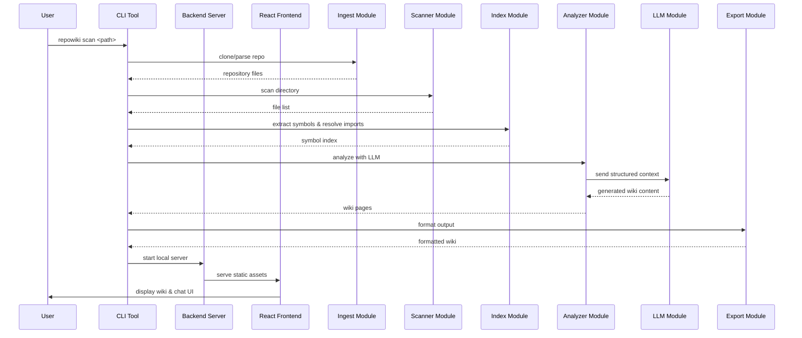

# Architecture

**Type:** client-server

The codebase implements a client-server architecture where a Rust-based backend provides both a CLI orchestration layer and an HTTP API server. A React frontend communicates with the backend via REST and WebSocket endpoints to display generated wiki documentation and enable interactive AI chat. The core processing pipeline ingests code, builds dependency graphs, indexes symbols, and leverages LLMs to generate structured documentation.

## Component Diagram

```mermaid
graph TD
  root --> cli
  root --> server
  root --> frontend
  root --> github
  cli --> core
  cli --> scanner
  cli --> graph
  cli --> cache
  cli --> llm
  cli --> rag
  cli --> index
  cli --> analyzer
  cli --> export
  cli --> ingest
  server --> core
  server --> scanner
  server --> graph
  server --> llm
  server --> rag
  server --> analyzer
  server --> export
  server --> ingest
  server --> cache
  frontend --> server
  analyzer --> index
  analyzer --> llm
  analyzer --> graph
  analyzer --> cache
  index --> graph
  index --> cache
  export --> cache
  ingest --> scanner
  llm --> core
  scanner --> core
  graph --> core
  cache --> core
  rag --> core
```

## Components

### frontend

React SPA for web interface, routing, state management, and Mermaid diagram rendering.

Files: [`frontend/package.json`](frontend), [`frontend/tsconfig.json`](frontend), [`frontend/vite.config.ts`](frontend), [`frontend/src/App.tsx`](frontend), [`frontend/index.html`](frontend), [`frontend/package-lock.json`](frontend), [`frontend/src/components/MermaidDiagram.tsx`](frontend), [`frontend/src/components/SettingsModal.tsx`](frontend), [`frontend/src/components/WikiContent.tsx`](frontend), [`frontend/src/components/WikiSidebar.tsx`](frontend), [`frontend/src/index.css`](frontend), [`frontend/src/lib/api.ts`](frontend), [`frontend/src/main.tsx`](frontend), [`frontend/src/pages/ChatView.tsx`](frontend), [`frontend/src/pages/Home.tsx`](frontend), [`frontend/src/pages/WikiView.tsx`](frontend), [`frontend/src/stores/wiki.ts`](frontend), [`frontend/src/vite-env.d.ts`](frontend)

### server

Axum-based HTTP/WebSocket API server handling scan requests, chat, wiki generation, and static file serving.

Files: [`crates/server/Cargo.toml`](server), [`crates/server/src/lib.rs`](server), [`crates/server/src/models.rs`](server), [`crates/server/src/routers/chat.rs`](server), [`crates/server/src/routers/mod.rs`](server), [`crates/server/src/routers/scan.rs`](server), [`crates/server/src/routers/wiki.rs`](server)

### export

Formatter module that converts generated wiki content into HTML, Markdown, or JSON outputs.

Files: [`crates/export/Cargo.toml`](export), [`crates/export/src/html.rs`](export), [`crates/export/src/json_export.rs`](export), [`crates/export/src/lib.rs`](export), [`crates/export/src/markdown.rs`](export), [`crates/export/src/site.rs`](export)

### root

Project root containing workspace configuration, environment examples, documentation, and licensing.

Files: [`.env.example`](root), [`Cargo.toml`](root), [`README.md`](root), [`.gitignore`](root), [`LICENSE`](root), [`README_CN.md`](root)

### index

Symbol extraction, metric computation, and import resolution module that builds a deterministic code index.

Files: [`crates/index/Cargo.toml`](index), [`crates/index/src/extract.rs`](index), [`crates/index/src/flow.rs`](index), [`crates/index/src/lib.rs`](index), [`crates/index/src/resolve.rs`](index)

### core

Shared foundation providing configuration management, model aliases, and common data models.

Files: [`crates/core/Cargo.toml`](core), [`crates/core/src/config.rs`](core), [`crates/core/src/lib.rs`](core), [`crates/core/src/models.rs`](core)

### ingest

Repository ingestion handler supporting local directories and GitHub URL cloning/parsing.

Files: [`crates/ingest/Cargo.toml`](ingest), [`crates/ingest/src/github.rs`](ingest), [`crates/ingest/src/lib.rs`](ingest), [`crates/ingest/src/local.rs`](ingest)

### llm

LLM client abstraction managing API communication, message formatting, prompts, and response parsing.

Files: [`crates/llm/Cargo.toml`](llm), [`crates/llm/src/client.rs`](llm), [`crates/llm/src/lib.rs`](llm), [`crates/llm/src/prompts.rs`](llm)

### scanner

Filesystem traversal engine respecting gitignore patterns, glob matching, and file filtering rules.

Files: [`crates/scanner/Cargo.toml`](scanner), [`crates/scanner/src/ignore_rules.rs`](scanner), [`crates/scanner/src/lib.rs`](scanner), [`crates/scanner/src/scan.rs`](scanner)

### .github

CI/CD workflow definitions for continuous integration and automated package publishing.

Files: [`.github/workflows/ci.yml`](.github), [`.github/workflows/publish.yml`](.github)

### analyzer

Orchestration module that coordinates indexed data with LLM calls to generate project overviews and wiki pages.

Files: [`crates/analyzer/Cargo.toml`](analyzer), [`crates/analyzer/src/lib.rs`](analyzer)

### cache

SQLite-backed persistence layer storing LLM results and content hashes to enable fast incremental re-runs.

Files: [`crates/cache/Cargo.toml`](cache), [`crates/cache/src/lib.rs`](cache)

### cli

Command-line interface entry point defining subcommands for scanning, serving, mapping, chatting, and configuration.

Files: [`crates/cli/Cargo.toml`](cli), [`crates/cli/src/main.rs`](cli)

### graph

Dependency graph builder utilizing PageRank algorithms to rank files and resolve module relationships.

Files: [`crates/graph/Cargo.toml`](graph), [`crates/graph/src/lib.rs`](graph)

### rag

Retrieval-Augmented Generation utilities handling text chunking, indexing fingerprints, and context retrieval.

Files: [`crates/rag/Cargo.toml`](rag), [`crates/rag/src/lib.rs`](rag)

## Sequence Diagram



## Data Flow

The system begins by ingesting and scanning the target codebase to extract files and build a dependency graph. An indexing phase compiles symbols and import resolutions, which feeds structured summaries into the analyzer. The analyzer queries the LLM to generate comprehensive wiki documentation, caches the results for incremental updates, and finally exports the output as markdown, HTML, or JSON for the CLI or web server.
